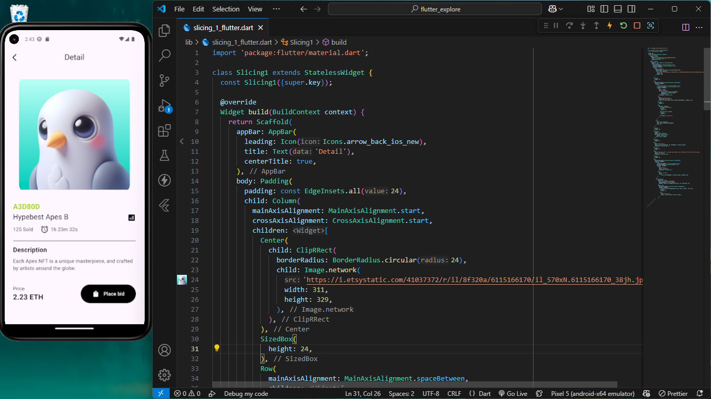

# 🚀 Flutter Task Repository  

This repository contains Flutter tasks given by [@abdillahfaiz](https://github.com/abdillahfaiz) as my mentor in TRPL D class. Each task is organized into a separate project folder, and the results of each task are documented with screenshots.

## 📂 Folder Structure  
```
├── tugas_flutter_1 /    # Flutter project tasks
├── tugas_flutter_2 /    # Flutter project tasks
├── tugas_flutter_3 /    # Flutter project tasks
├── Result/              # Folder containing screenshots of task results
│   ├── screenshoot...
├── README.md            # Documentation
```


## 📌 Task List  

### 1️⃣ Project Flutter 1 - UI Slicing Design  
This project focuses on slicing a given UI design into a functional Flutter interface.  
📷 Output:  

  


## 🔧 How to Use  
To run any of these projects on your local machine:  
1. Clone the repository:  
   ```sh
   git clone https://github.com/Ridhsuki/flutter_lesson.git
   cd flutter_lesson
   ```
2. Navigate to a project folder and run:  
   ```sh
   flutter pub get
   flutter run
   ```

## 📌 Notes  
- The `Result/` folder contains images showcasing the task outputs.  
- This repository will be continuously updated as more tasks are completed.  
