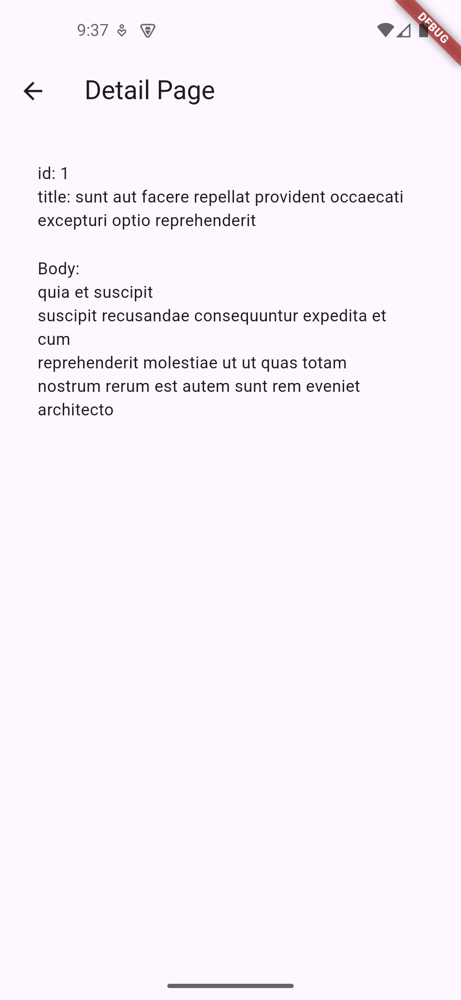

# 🚀 Flutter Task Repository  

This repository contains Flutter tasks given by [@abdillahfaiz](https://github.com/abdillahfaiz) as my mentor in TRPL D class. Each task is organized into a separate project folder, and the results of each task are documented with screenshots.

## 📂 Folder Structure  
```
├── folder_tugas_1 /  
├── folder_tugas_2 /    
├── folder_tugas_3 /  
├── Result/              # Folder containing screenshots of task results
│   ├── screenshoot...
├── README.md            # Documentation
```

## 📷 Output:

<p align="center">
    
    
    
    
    
    
    
    
    
    
</p>


## 📌 Notes  
- The `Result/` folder contains images showcasing the task outputs.  
- This repository will be continuously updated as more tasks are completed.  
